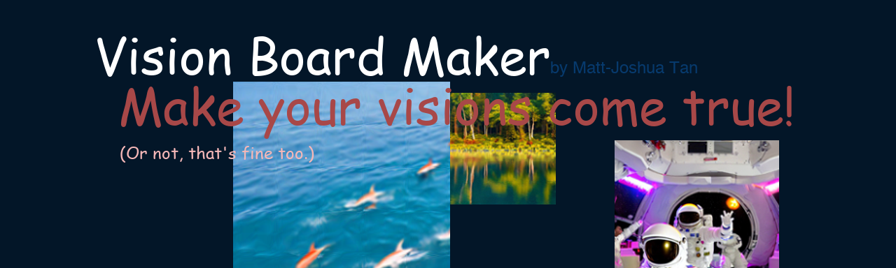

# Vision Board Maker

## CS110 Final Project Spring, 2024

## Team Members

Matt-Joshua Tan

***

## Project Description

Create your own vision board in Pygame! Use your imagination and Stable Diffusion to create a sweet little poster.

***    

## GUI Design

### Initial Design

### Final Design

TBD

## Program Design

### Features

1. Add your own text with customizable color, size, and font
2. Add locally AI-generated images
3. Change the background color
4. Move or remove text and images if you change your mind
5. Save your vision board as an image to print out and put on your wall!

### Classes

Expected classes:
1. Text class (as sprite) holds text in vision board as objects
2. Image class (as sprite) holds images in vision board as objects

## ATP

| Step                 |Procedure             |Expected Results                   |
|----------------------|:--------------------:|----------------------------------:|
| 1: Enter the vision board creator             | Click the start menu  | A GUI should appear with 3 main sections: the Edit Panel, a Tips panel, and a "Save as Image" button. |
| 2: Adding Text                   | Click 'Add Text' | The Edit Panel and Save as Image button will be disabled, and a Color Picker and an Add Text window will open. |
| 3: Choosing Text Color | Select a color in the Color Picker and press OK | The color will be saved for the text. |
| 4: Customizing Text | Slide to select text size, type text, and choose a font in the dropdown, then press Submit | A second window will show up that says "Click to place object" |
| 5: Placing Text | Click anywhere on the screen | The complete text will appear with the chosen text, color, font, size and location. |
| 6: Adding Image | Click 'Add Image' | The Edit Panel and Save as Image button will be disabled, and a single window "Generate AI Image" appears. |
| 7: Creating Image | Type your prompt and press Submit | The "Click to place object" window will show up. |
| 8: Placing Image | Click anywhere on the screen | Stable Diffusion will generate an image with your prompt (can take a while), then your image appears as a square at the given location. |
| 9: Removing Text and Image | Right click on an existing text or image | Any text or image at the location clicked will be deleted. |
| 10: Dragging Text and Image | Left click on an existing text or image | Any text or image will be moved around with your mouse until you release your left click. |
| 11: Resizing Text and Image | Click on an existing text or image and press the up/down key | Any text or image at the location clicked will be scaled up or down.|
| 12: Changing the Background Color | Click 'Change BG' | A Background Color Picker will appear. |
| 13: Choosing a Background Color | Choose a color in the Background Color Picker and press OK | The background will change to the given color.
| 14: Saving the Board State | Press Z | Your text, images, and background color will be saved. |
| 15: Loading the Board State | (Preferably after modifying the board again) Press C | Your saved board will be reloaded. |
| 16: Saving Board as Image | Press "Save as Image" in bottom right corner. | The image will be saved as a png in the "etc" folder of the program. | 
