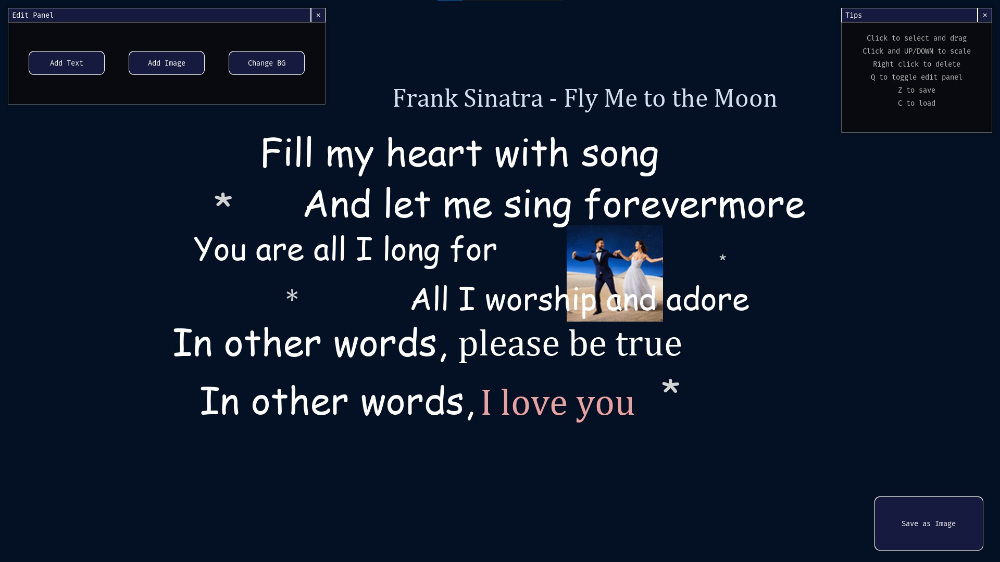

# Vision Board Maker
## CS110 Final Project Spring, 2024

## Team Members

Matt-Joshua Tan

***

## Project Description

Create your own vision board in Pygame!

***    

## GUI Design

### Initial Design

idk

### Final Design

idk

## Program Design

### Features

1. Add text with customizable color, size, and font
2. Add images from various sources
3. Change the background color
4. (?) Create random vision boards!
5. Save your vision board!

### Classes

Expected classes:
1. Text class (as sprite)
2. Image class (as sprite)
3. GUI class? (idk) (use pygame gui module)
4. utility class (constants like window size, max text/images)

## ATP

| Step                 |Procedure             |Expected Results                   |
|----------------------|:--------------------:|----------------------------------:|
|  1                   | Run program  |Start menu appears |
|  2                   | Click 'Add Text' | 'Add Text' window opens in middle      |
| 3 | Customize your text | 'Choose Location' prompt shows up |
| 4 | Click desired text location | Customized text appears in location |
| 5 | I'll figure it out later | ... | 
etc...
